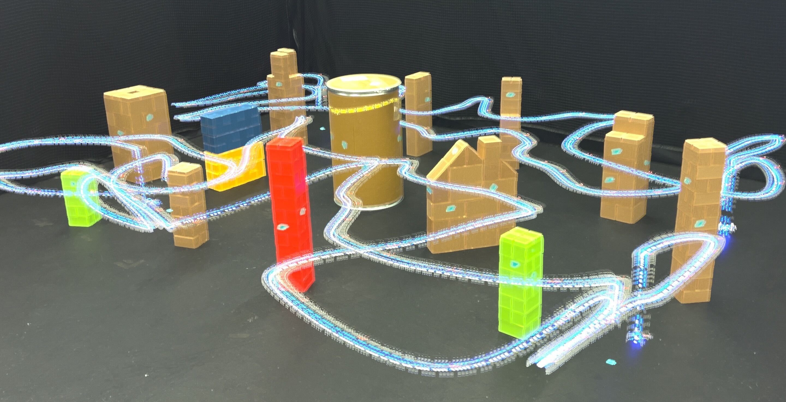

<h1 align="center">
    Safety-Critical Ergodic Exploration in Cluttered Environments via Control Barrier Functions
</h1>

<p align="justify">
Code for <a href="">Safety-Critical Ergodic Exploration in Cluttered Environments via Control Barrier Functions</a>. Cameron Lerch, Dayi Dong, and Ian Abraham. In International Conference for Robotics and Automation (ICRA), 2023. 
Additional results and details found <a href="https://arxiv.org/abs/2211.04310">here</a>.
</p>

<p align="center">
    
</p>

<p align="justify">
    In this paper, we address the problem of safe trajectory planning for autonomous search and exploration in constrained, cluttered environments. 
    Guaranteeing safe (collision-free) trajectories is a challenging problem that has garnered significant due to its importance in the successful utilization of robots in search and exploration tasks. 
    This work contributes a method that generates guaranteed safety-critical search trajectories in a cluttered environment. Our approach integrates safety-critical constraints using discrete control barrier functions (DCBFs) with ergodic trajectory optimization to enable safe exploration.
    Ergodic trajectory optimization plans continuous exploratory trajectories that guarantee complete coverage of a space. 
    We demonstrate through simulated and experimental results on a drone that our approach is able to generate trajectories that enable safe and effective exploration. 
    Furthermore, we show the efficacy of our approach for safe exploration using real-world single- and multi- drone platforms.
</p>


## Citation
'''
@article{Lerch_2022_SC_ETO,
  doi = {10.48550/ARXIV.2211.04310},
  url = {https://arxiv.org/abs/2211.04310},
  author = {Lerch, Cameron and Dong, Ethan and Abraham, Ian},
  keywords = {Robotics (cs.RO), FOS: Computer and information sciences, FOS: Computer and information sciences},
  title = {Safety-Critical Ergodic Exploration in Cluttered Environments via Control Barrier Functions},
  publisher = {arXiv},
  year = {2022},
  copyright = {Creative Commons Attribution 4.0 International}
}
'''
<!-- ```
@article{dong2023TimeOptErg,
    title={Time-Optimal Ergodic Search}, 
    author={Dong, Dayi and Berger, Henry and Abraham, Ian},
    journal={RSS},
    year={2023},
}
``` -->