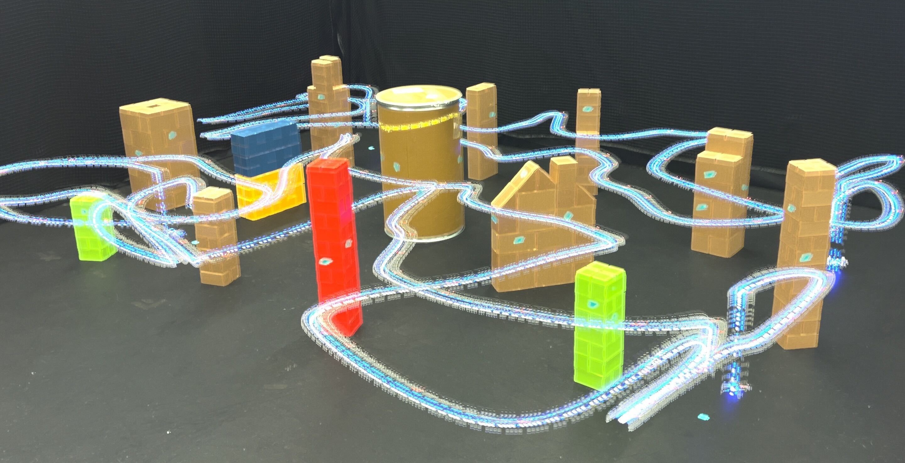

<h1 align="center">
    Safety Critical Ergodic Exploration
</h1>

<p align="justify">
Code for <a href="">Safety-Critical Ergodic Exploration in Cluttered Environments via Control Barrier Functions</a>. Cameron Lerch, Dayi Dong, and Ian Abraham. In International Conference on Robotics and Automation (ICRA), 2023.
<!-- Additional results and multimedia videos found <a href="https://sites.google.com/view/time-optimal-ergodic-search">here</a>. -->
</p>

<p align="center">
    
</p>

<p>
In the realm of search and rescue, a robot's ability to not only completely cover and area but to also ensure its own safety during the process can be crucial to the success of a mission upon which lives could depend.
Previous work in ergodic coverage-based search methods have been able to ensure the complete search of a predefined area with respect what is referred to as the ergodic metric.
The concept of safety during search is also one that has seen progress to avoid obstacles, but the issue is that these methods make no formal guarantees of the robot's safety during the search trajectory.
We propose the use of discrete-time control barrier functions as inequality constraints to ensure the safety along a trajectory.
To prove the efficacy of this method, we test it against traditional distance constraints and show its success both in simulated environments and with drone experiments. 
</p>

## Directory Descriptions
All utilities and supplemental scripts are contained within [erg_traj_opt_lib](erg_traj_opt_lib/)

Main scripts for generating trajectories are contained in [collision_stats](experiments/collision_stats/) while the main script for running ablation experiment is contained in [alpha_ablation](experiments/alpha_ablation/)

## File Descriptions

Within [collision_stats](experiments/collision_stats/), [run_safety_critical.py](experiments/collision_stats/run_safety_critical.py) uses the CBF safety critical constraints to generate 50 trajectories using random initial and final state pairs. It saves the trajectories into a directory that needs to be specified and the 50 inital and final state pairs are saved into a numpy data file in that directory as well.

Within [collision_stats](experiments/collision_stats/), [run.py](experiments/collision_stats/run.py) uses normal inequality constraints to generate 50 trajectories using the same initial and final state pairs from run_safety_critical.py. It saves the trajectories into a directory that needs to be specified.

Within [alpha_ablation](experiments/alpha_ablation/), [run.py](experiments/alpha_ablation/run.py) generates trajectory graphs for each of the values of gamma for the same exploration space and initial and final conditions. Then, it generates a graph of the ergodic metric versus the values of gamma.


## Citation

```
@article{lerch2022safety,
  title={Safety-Critical Ergodic Exploration in Cluttered Environments via Control Barrier Functions},
  author={Lerch, Cameron and Dong, Ethan and Abraham, Ian},
  journal={arXiv preprint arXiv:2211.04310},
  year={2022}
}
```


<!-- # SafetyCriticalErgodicExploration


## Description
Ergodic trajectory planning with safety critical constraints

## Directory Descriptions
All utilities and supplemental scripts are contained within [erg_traj_opt_lib](erg_traj_opt_lib/)

Main scripts for generating trajectories are contained in [collision_stats](experiments/collision_stats/) while the main script for running ablation experiment is contained in [alpha_ablation](experiments/alpha_ablation/)

## File Descriptions

Within [collision_stats](experiments/collision_stats/), [run_safety_critical.py](experiments/collision_stats/run_safety_critical.py) uses the CBF safety critical constraints to generate 50 trajectories using random initial and final state pairs. It saves the trajectories into a directory that needs to be specified and the 50 inital and final state pairs are saved into a numpy data file in that directory as well.

Within [collision_stats](experiments/collision_stats/), [run.py](experiments/collision_stats/run.py) uses normal inequality constraints to generate 50 trajectories using the same initial and final state pairs from run_safety_critical.py. It saves the trajectories into a directory that needs to be specified.

Within [alpha_ablation](experiments/alpha_ablation/), [run.py](experiments/alpha_ablation/run.py) generates trajectory graphs for each of the values of gamma for the same exploration space and initial and final conditions. Then, it generates a graph of the ergodic metric versus the values of gamma. -->